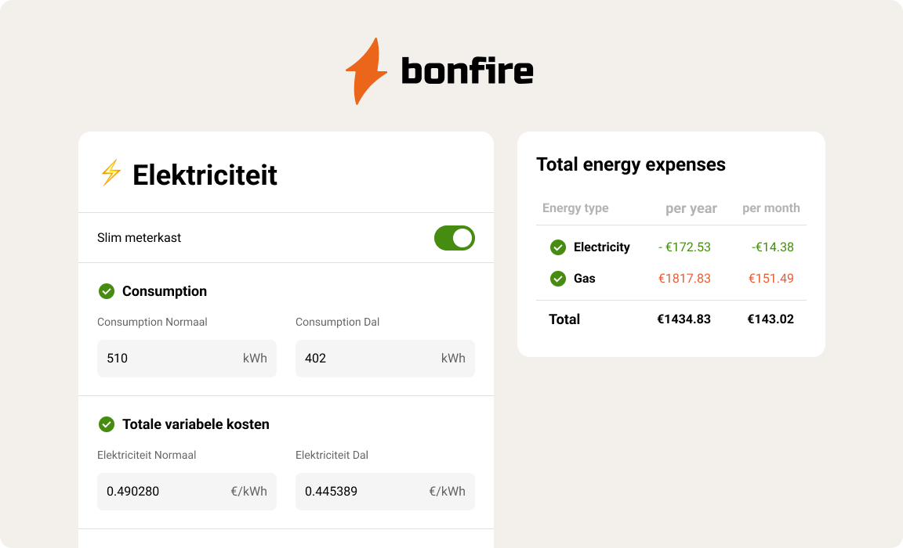

# 🔥 Bonfire

Energy cost calculator for housing in the Netherlands. It gives you a rough estimate of your annual/monthly expenses based on energy supplier's and net provider's rates and your gas and electricity consumption.

- [Deployed demo](https://srgprp-bonfire.herokuapp.com/)
- [Math behind the calculator](./docs/math.md)
- Want to install and test? Clone the repo, then `npm install` and then `npm run dev`.

## Why

Knowing energy rates is not enough to calculate annual energy expenses. You have to consider grid owner prices, tax reductions, and a number of other variables. This app asks you for specific values, points where to find them in your contract, and makes all necessary calculations for you.
