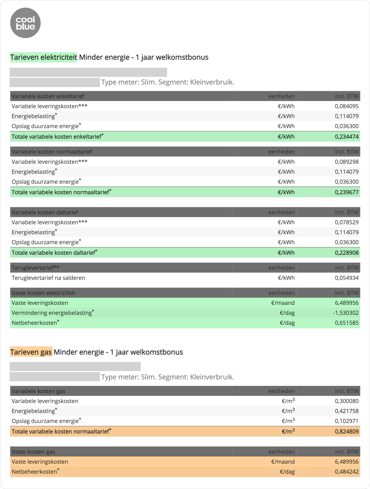

# Math

Explanation of the math behind gas-burner app.

## What do you need
To calculate energy expenses you need to have: 
- **Annual energy consumption**. For gas and electricity for a year.
- **Rates agreement `Tarieven overeenkomst`**. The document that you get after you made a contract with an energy supplier.

### Annual energy consumption

Consumption is basically how much energy (electricity and gas) you spend in a year. You have to figure out numbers yourself or visit [Gemiddeld energieverbruik](https://www.milieucentraal.nl/energie-besparen/inzicht-in-je-energierekening/gemiddeld-energieverbruik/#:~:text=Een%20Nederlands%20huishouden%20verbruikt%20jaarlijks,zijn%20in%202022%20grote%20verschillen.) to find average numbers for a household similar to yours.

For this example I'm going to use my own data for 2021 year.

| Type                             | Consumption per year (2021)   |
| -------------------------------- | ----------------------------- |
| Electricity consumption: Normaal | 507  kWh                      |
| Electricity consumption: Dal     | 402 kWh                       |
| Gas consumption                  | 1200 m³                       |
### Rates agreement `Tarieven overeenkomst`

You receive this document after you signed a contract with energy supplier. In this document you find rates...



## ⚡️ Electricity

There 4 types of expenses that you should keep an eye on regarding electricity.

### 1. El. variable costs `variabele kosten`

Money that you pay to energy supplier for electricity that you have used. They are called "variable" since they depend on your consumption.

<details><summary><b>Is your meter box smart?</b></summary>    

<p>There is two types of meter boxes: smart (slim) and not smart. </p>
<p>If your meter box is not smart, it has only one reading – enkel. If your meter box is smart, it has two readings: day readings (normaal), night readings (dal).</p>

</details>


```javascript
// If your meterkast is not slim
const elConsumptieEnkel = 911; // kWh
const elEnkelTotVarKosten = 0.470799; // €/kWh
const elTotVarKostenPerJaar =
    elConsumptieEnkel * elEnkelTotVarKosten;
// RESULT
// Total electricity variable costs for this year are 429€ 
```
```javascript
// If your meterkast is slim

const elConsumptieNormaal = 507; // kWh 
const elConsumptieDal = 402; // kWh

const elNormaalTotVarKosten = 0.490280; // €/kWh
const elDalTotVarKosten = 0.445389; // €/kWh

const elTotVarKostenPerJaar =
    elConsumptieNormaal * elNormaalTotVarKosten +
    elConsumptieDal * elDalTotVarKosten;

// RESULT
// Total electricity variable costs for this year are 428€ 
```

### 2. El. fixed costs `vaste leveringskosten`

Fixed amount of money that you pay to energy supplier. They are the same every month and non-dependent on your consumption. Think about them as subscription fee.

```javascript
const elVasteLevKosten = 6.489956; // €/month
const elVasteLevKostenPerJaar = elVasteLevKosten * 12;
// RESULT
// Total electricity fixed costs for this year are 78€
```

### 3. El. reduction energy tax `vermindering energiebelasting`

The government sets energy tax, that makes energy more expensive, to force people to save energy. But for electricity it also provides tax reduction.

The size of tax reduction depends on a year when your contract starts. For 2022 it is € 824,77.
```javascript
const elVerminEnergBelasting = -2.259650; // €/day
const elVerminEnergBelastingPerJaar = elVerminEnergBelasting * 365;
// RESULT
// Reduction energy tax for this year is -825€
```

### 4. El. delivery costs `netbeheerkosten`

Money that you pay to grid operator for connection and transport of electricity.

```javascript
const elNetbeheerKosten = 0.696597; // €/day
const elNetbeheerKostenPerJaar = elNetbeheerKosten * 365;
// RESULT
// Reduction energy tax for this year is 254€
```
### Total el. costs

Add up all costs to get total for a year for electricity.

```javascript
const elKostenPerJaar =
        elTotVarKostenPerJaar +
        elVasteLevKostenPerJaar +
        elVerminEnergBelastingPerJaar +
        elNetbeheerKostenPerJaar;

// RESULT
// Expenses for electricity this year are -65€

// Divide by 12 to get monthly average
const elKostenPerMaand = elKostenPerJaar / 12;

// RESULT
// Monthly average expenses for electricity are -5.42€
```
> Depending on your electricity consumption your total electricity expenses can come out negative thanks to reduction energy tax.
## 🔥 Gas

### 1. Gas variable costs `variabele kosten`

Money that you pay to energy supplier for gas that you actually have used. They are called "variable" since they depend on your consumption.

```javascript
const gasConsumptie = 1200; // m³
const gasTotVarKosten = 1.927312; // €/m³

const gasTotVarKostenPerJaar = 
    gasTotVarKosten * gasConsumptie;

// RESULT
// Total gas variable costs for this year are 2313€
```
### 2. Gas fixed costs `vaste kosten`

Fixed amount of money that you pay to energy supplier for gas. They are the same every month and non-dependent on your consumption. Think about them as subscription fee.

```javascript
const gasVasteLevKosten = 6.489956; // €/month
const gasVasteLevKostenPerJaar = gasVasteLevKosten * 12;

// RESULT
// Total gas fixed costs for this year are 78€
```
### 3. Gas delivery costs `netbeheerkosten`

Money that you pay to grid operator for connection and transport of gas.

```javascript
const gasNetbeheerKosten = 0.512435; // €/day
const gasNetbeheerKostenPerJaar = gasNetbeheerKosten * 365;

// RESULT
// Total gas delivery costs for this year are 187€
```
### Total gas costs

Add up all costs to get total for a year for gas.

```javascript
const gasKostenPerJaar = 
    gasTotVarKostenPerJaar + 
    gasVasteLevKostenPerJaar + 
    gasNetbeheerKostenPerJaar;

// RESULT
// Total gas costs for this year are 5155€

const gasKostenPerMaand = gasKostenPerJaar / 12;

// RESULT
// Monthly average expenses for gas are 430€
```

## 🏁 Total energy costs

Finally add up total electricity costs and total gas costs and you will get total energy cost.

```javascript
const totaleKostenPerJaar = elKostenPerJaar + gasKostenPerJaar;

// RESULT
// Total energy costs for this year are 5090€

const totaleKostenPerMaand = totaleKostenPerJaar / 12;

// RESULT
// Monthly average expenses for energy are 424€
```